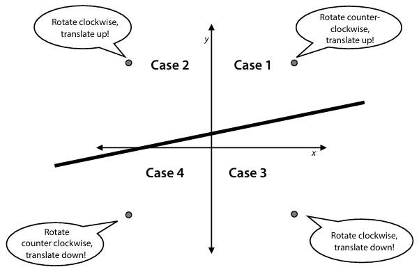

# Chapter 3: Drawing a line close to out points: Linear Regression

## Omschrijf in pseudocode het **linear regression algorithm**.

Een lineair regressie algoritme is een methode om een lijn te vinden die zo dicht mogelijk bij een reeks punten ligt.
- **Input**: een dataset van punten, een aantal iteraties, een learning rate
- **Output**: een linear regressie model dat de dataset benadert
- **Procedure**:
    1. Initialiseer het model met random gewichten en een random bias
    2. Herhaal vele malen
        1. Kies een willekeurig datapunt
        2. Pas de gewichten en bias licht aan om de voorspelling voor dat specifieke datapunt te verbeteren
    3. Retourneer het verkregen model
Het aanpassen van de gewichten en bias kan gebeuren op verschillende manieren, zoals de simple trick, square trick of absolute trick.

## Beschrijf bondig de kenmerken van het **linear regression algorithm**, volgens volgende 3 methoden:
- **Simple trick**
    Identificeert de positie van een punt ten opzichte van de lijn om de lijn dichterbij te brengen door middel van rotaties en translaties. De verplaatsing van de lijn gebeurd in de richting van het punt. Als het punt boven de lijn ligt, wordt de lijn naar boven verplaatst. Als het punt onder de lijn ligt, wordt de lijn naar beneden verplaatst. De rotatie is afhankelijk van de positie van het punt ten opzichte van de y-as. Als het punt rechts van de y-as ligt, wordt de lijn met de klok mee geroteerd. Als het punt links van de y-as ligt, wordt de lijn tegen de klok in geroteerd. Deze methode is een minder effectieve methode ten opzichte van de square en absolute trick.

    

- **Square trick**
    Het verschil tussen de werkelijke waarde en de voorspelde waarde wordt bepaald en toegevoegd aan het y-intercept. ls het verschil positief is wordt de lijn naar boven verplaatst, als het verschil negatief is wordt de lijn naar beneden verplaatst. De rotatie van de lijn gebeurd door de x-waarde van het punt te vermenigvuldigen met het verschil. Als het punt rechts van de y-as ligt, wordt de lijn met de klok mee geroteerd. Als het punt links van de y-as ligt, wordt de lijn tegen de klok in geroteerd. Deze methode is effectiever dan de simple trick.

- **Absolute trick**
    Er wordt enkel gebruik gemaakt van de positie van het punt ten opzichte van de lijn om aanpassingen te maken. De verplaatsing van de lijn gebeurd in de richting van het punt. Als het punt boven de lijn ligt, worden de helling en het y-intercept verhoogd. Als het punt onder de lijn ligt, worden de helling en het y-intercept verlaagd. Deze methode ligt tussen de simple en square trick in qua effectiviteit.

## Waarom kiest men bij het bepalen van de fout de **mean absolute error (MAE)** of de **mean square error (MSE)**? Waarom werkt men dan praktisch met de **root mean square error (RMSE)**?
De **mean absolute error (MAE)** meet de gemiddelde absolute afstand tussen de voorspelde waarden en de werkelijke waarden. Het geeft aan hoe ver de voorspelling gemiddeld van de werkelijke waarden afliggen. 
De **mean square error (MSE)** meet de gemiddelde kwadratische afstand tussen de voorspelde waarden en de werkelijke waarden. Door de verschillen te kwadrateren, worden grote verschillen groter en kleine verschillen kleiner. 
In de praktijk wordt vaak gewerkt met de **root mean square error (RMSE)** omdat deze de eenheid van de fouten terugbrengt naar de oorspronkelijke eenheid van de data. Dit maakt het makkelijker om de fouten te interpreteren.

## Hoe moet een niet-lineaire dataset worden aangepast als de **lineaire regressie** getransformeerd wordt in **polynomial regression** via een polynoom van graad 4?
Om een niet-lineaire dataset aan te passen met polynomiale regressie (graad 4), worden extra features toegevoegd aan de dataset. Naast de oorspronkelijke feature (x) worden kolommen toegevoegd voor x², x³ en x⁴. Vervolgens wordt lineaire regressie toegepast op deze uitgebreide dataset om de relatie tussen y en de verschillende machten van x te modelleren. Het resulterende model heeft de vorm:
y = b + w₁x + w₂x² + w₃x³ + w₄x⁴, waarbij b de bias is en w₁–w₄ de gewichten van de features.