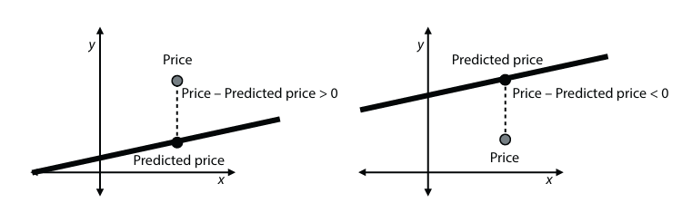

# Chapter 3: Drawing a line close to out points: Linear Regression

## Omschrijf in pseudocode het **linear regression algorithm**.

Een lineair regressie algoritme is een methode om een lijn te vinden die zo dicht mogelijk bij een reeks punten ligt.

- **Input**: een dataset van punten in een vlak
- **Output**: een lineair regressie model (lijn) die de punten het beste benadert
- **Procedure**:
    - Kies willekeurige waarden voor de gewichten (w) en bias (b)
    - Herhaal vele malen:
        - Kies een willekeurig punt uit de dataset
        - Pas de gewichten en bias aan op basis van de positie van het punt ten opzichte van de lijn
    - Return de gewichten en bias als het lineaire regressie model

Het aanpassen van de gewichten en bias kan op verschillende manieren gebeuren, afhankelijk van de gekozen methode (bijv. simple trick, square trick, absolute trick).

## Beschrijf bondig de kenmerken van het **linear regression algorithm**, volgens volgende 3 methoden:

- **Simple trick**

    De verplaatsing van de lijn gebeurt door deze te roteren en te transleren in de richting van het punt. De rotatie wordt bepaald door de slope van de lijn te veranderen, de translatie wordt bepaald door de y-intercept te veranderen.
    Er zijn 4 specifieke gevallen:
    1. Het punt ligt boven de lijn en rechts van de y-as: de lijn wordt tegen de klok in geroteerd en omhoog getransleerd.
    2. Het punt ligt boven de lijn en links van de y-as: de lijn wordt met de klok mee geroteerd en omhoog getransleerd.
    3. Het punt ligt onder de lijn en rechts van de y-as: de lijn wordt met de klok mee geroteerd en omlaag getransleerd.
    4. Het punt ligt onder de lijn en links van de y-as: de lijn wordt tegen de klok in geroteerd en omlaag getransleerd.

    

- **Square trick**

    De verplaatsing van de lijn gebeurt door het y-intercept en de slope aan te passen op basis van het verschil tussen de werkelijke waarde (y) en de voorspelde waarde (y').
    De y-intercept wordt verhoogd als het punt boven de lijn ligt en verlaagd als het punt onder de lijn ligt.
    De slope wordt aangepast door het verschil te vermenigvuldigen met de x-waarde van het punt.
    De learning rate bepaalt hoe groot de aanpassing is. Deze methode is effectiever dan de simple trick, omdat het de helling van de lijn aanpast op basis van de afstand tot het punt.

    

- **Absolute trick**

    De absolute trick is een tussenvorm tussen de simple trick en de square trick. Het is een minder complexe methode dan de square trick, maar effectiever dan de simple trick.
    De aanpassing van de lijn is gebaseerd op twee gevallen: 
    - Het punt ligt boven de lijn: tel (learning rate * x) bij de slope, dit roteert de lijn tegen de klok in als het punt rechts van de y-as ligt en met de klok mee als het punt links van de y-as ligt. Tel learning rate bij de y-intercept. Dit transleert de lijn omhoog.
    - Het punt ligt onder de lijn: trek (learning rate * x) af van de slope, dit roteert de lijn met de klok mee als het punt rechts van de y-as ligt en tegen de klok in als het punt links van de y-as ligt. Trek learning rate af van de y-intercept. Dit transleert de lijn omlaag.

## Waarom kiest men bij het bepalen van de fout de **mean absolute error (MAE)** of de **mean square error (MSE)**? Waarom werkt men dan praktisch met de **root mean square error (RMSE)**?

De **mean absolute error (MAE)** meet de gemiddelde verticale afstand (absolute fout) tussen de voorspelde waarden en de werkelijke waarden. De absolute fout kan zowel positief als negatief zijn, maar door de absolute waarde te nemen, worden negatieve fouten genegeerd. 

De **mean square error (MSE)** meet de gemiddelde som van de kwadraten van de verticale afstanden (kwadratische fout) tussen de voorspelde waarden en de werkelijke waarden. Het kwadrateren van de fouten zorgt ervoor dat foutwaarden voor elk punt altijd positief zijn.

De **root mean square error (RMSE)** is de vierkantswortel van de MSE en geeft een maat voor de gemiddelde afwijking van de voorspellingen ten opzichte van de werkelijke waarden. In praktijk wordt RMSE gebruikt omdat het dezelfde eenheden heeft als de oorspronkelijke data, waardoor het gemakkelijker te interpreteren is.

## Hoe moet een niet-lineaire dataset worden aangepast als de **lineaire regressie** getransformeerd wordt in **polynomial regression** via een polynoom van graad 4?

Om een niet-lineaire dataset aan te passen met polynomiale regressie (graad 4), worden extra features toegevoegd aan de dataset. Naast de oorspronkelijke feature (x) worden kolommen toegevoegd voor x², x³ en x⁴. Vervolgens wordt lineaire regressie toegepast op deze uitgebreide dataset om de relatie tussen y en de verschillende machten van x te modelleren. Het resulterende model heeft de vorm:
y = b + w₁x + w₂x² + w₃x³ + w₄x⁴, waarbij b de bias is en w₁–w₄ de gewichten van de features.