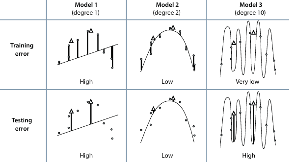
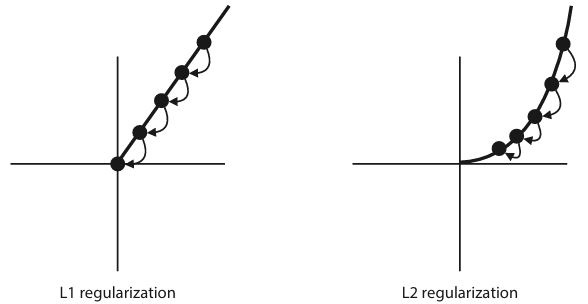

# Chapter 4: Underfitting, overfitting, testing and regularization

## Hoe kan underfitting, optimal fitting en overfitting worden bepaald door de training error en de test error met elkaar te vergelijken?

**Underfitting:** 

Een model dat underfit, presteert slecht op zowel de trainingsset als de testset. Beide fouten zijn hoog. Dit betekent dat het model te simpel is en de data niet goed kan leren.

**Optimale fitting:** 

Een model dat goed past, presteert goed op zowel de trainingsset als de testset. Beide fouten zijn laag. Dit betekent dat het model de juiste complexiteit heeft om de data goed te leren en te generaliseren naar nieuwe data.

**Overfitting:** 

Een model dat overfit, presteert zeer goed op de trainingsset, maar slecht op de testset. De trainingsfout is laag, terwijl de testfout hoog is. Dit betekent dat het model te complex is en de data memoriseert in plaats van het te leren, waardoor het niet goed kan generaliseren naar nieuwe data.

## Hoe kan underfitting, optimal fitting en overfitting worden bepaald door de validatie error en de test error met elkaar te vergelijken?

**Underfitting:** 

Een model dat underfit, presteert slecht op zowel de validatie set als de test set. Beide fouten zijn hoog.

**Optimal fitting:** 

Een model dat goed past, presteert goed op zowel de validatie set als de test set. Beide fouten zijn laag.

**Overfitting:** 

Een model dat overfit, presteert zeer goed op de validatie set, maar slecht op de test set. De validatie fout is laag, terwijl de test fout hoog is.

## Wat is de L1-norm en de L2-norm voor het bepalen van de complexiteit van een model?
Deze normen worden gebruikt om de complexiteit van het model te meten, zodat het model niet te simpel of te complex wordt.

**L1-norm** heeft de eigenschap dat het de coëfficiënten van minder belangrijke features naar nul kan zetten, waardoor het model schaalbaarder en interpreteerbaar wordt. Hierbij wordt de som van de absolute waarden van de coëfficiënten geminimaliseerd.

**L2-norm** heeft de eigenschap dat het de coëfficiënten van minder belangrijke features klein maakt, maar niet nul, waardoor het model robuuster wordt tegen ruis in de data. Hierbij wordt de som van de kwadraten van de coëfficiënten geminimaliseerd.

## Bespreek:
- **Lasso regression error**

    De lasso regression error is de fout die ontstaat bij het gebruik van L1 regularisatie tijdens het trainen van een regressiemodel. De foutfunctie voor Lasso regressie is als volgt: 

    Lasso regressie fout = Regressie fout + L1 norm. 

    L1 regularisatie heeft de neiging om coëfficiënten in het model naar nul te dwingen, waardoor het model eenvoudiger wordt en minder gevoelig voor overfitting.

- **Ridge regression error**

    De ridge regression error is de fout die ontstaat bij het gebruik van L2 regularisatie tijdens het trainen van een regressiemodel. De foutfunctie voor Ridge regressie is als volgt: 
    
    Ridge regressie fout = Regressie fout + L2 norm. 
    
    In tegenstelling tot L1 regularisatie, verkleint L2 regularisatie de coëfficiënten, maar maakt ze zelden exact nul. Dit resulteert in een model met kleinere coëfficiënten, wat ook helpt om overfitting te verminderen.

Het belangrijkste verschil tussen L1 (Lasso) en L2 (Ridge) regularisatie is de manier waarop ze de complexiteit van het model beïnvloeden. L1 regularisatie is nuttig wanneer er veel features zijn en de meeste irrelevant zijn. L2 regularisatie is meer geschikt wanneer de meeste features relevant zijn, maar de coëfficiënten te groot zijn.

