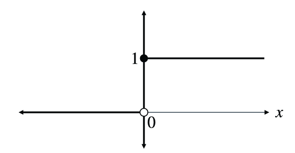
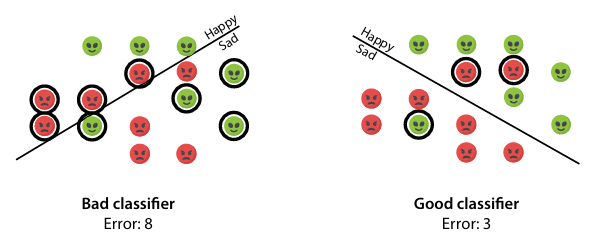
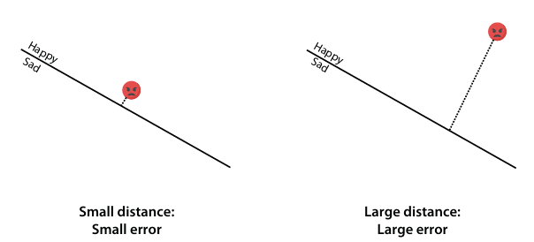
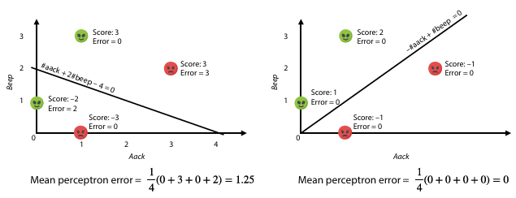

# Chapter 5: The perceptron algorithm

## Waarom kan de step function als activation function worden gebruikt bij lineaire classificatie zoals bij het perceptron algoritme? Waarom wordt de step activation function toch minder frequent toegepast bij machine learning?

De stapfunctie kan worden gebruikt als een activatiefunctie bij lineaire classificatie, zoals bij het perceptron algoritme, omdat deze de uitvoer van het model omzet in een binaire waarde, waardoor een beslissing kan worden genomen over de klasse waartoe een bepaald datapunt behoort.
De redenen waarom de stapfunctie minder frequent wordt toegepast zijn:

- De stapfunctie is niet differentieerbaar (discontinu), wat problemen kan veroorzaken bij het gebruik van gradient descent voor het optimaliseren van de parameters van het model.

- De stapfunctie heeft enkel aan of er een fout is gemaakt of niet, maar geeft geen informatie over hoe ver de voorspelling van het model van de werkelijke waarde afwijkt.

## Bespreek hoe het geoptimaliseerde perceptron algoritme ( = perceptron trick) functioneert. Toon aan hoe het leerproces geleidelijk aan de vergelijking van een optimale rechte bepaalt om een oorspronkelijke dataset op te splitsen in twee klassen.

- **Input**:
    - Een perceptron classifier met gewichten en bias
    - Een dataset van punten (x1, x2, ..., xn) met labels (y1, y2, ..., yn)
    - Een leersnelheid (learning rate)

- **Output**:
    - Een geoptimaliseerde perceptron classifier met nieuwe gewichten en bias

- **Procedure**:
    - Initialiseer de gewichten en bias van de perceptron classifier met willekeurige waarden
    - Iteratie:
        - een willekeurig punt uit de dataset selecteren
        - bereken de voorspelling van de perceptron met de vergelijking 
        y=step(ax1+bx2+c)
        - indien het punt correct geclassificeerd is, worden de gewichten en bias niet aangepast
        - indien het punt verkeerd geclassificeerd is, worden de gewichten en bias aangepast met de perceptron trick:
            - a' = a + learning_rate * (y - y') * x1
            - b' = b + learning_rate * (y - y') * x2
            - c' = c + learning_rate * (y - y')
    - Herhaal de iteraties het proces
    - Stop na een vooraf bepaald aantal iteraties, de fout convergeert naar nul of een andere stopconditie.

## Geef een aantal voorbeelden van een geschikte error functie voor perceptron learning om het leerproces te ondersteunen. Welke error functie stel jij voor en verklaar waarom dit een geschikte error functie is voor bijvoorbeeld binaire classificatie?
Er zijn verschillende error functies die kunnen gebruikt worden voor perceptron learning, zoals:

- **Aantal fouten**: telt het aantal fouten dat het model maakt bij het classificeren van de dataset, dit vertelt ons enkel wanneer er een fout is, maar meet niet de grootte van de fout. Dus dit is niet optimaal.

- **Afstand**: deze functie meet de loodrechte afstand van een punt tot de voorspelde beslissingsgrens, punten die correct geclassificeerd zijn hebben een afstand van nul, punten die fout geclassificeerd zijn hebben een error gelijk aan de afstand tot de beslissingsgrens. Dit is een ingewikkelde formule omdat het een vierkantswortel bevat, deze hebben ingewikkelde afgeleiden.

- **Score:** de perceptron error functie kent een waarde toe die evenredig is met de afstand van een punt tot de beslissingsgrens voor verkeerd geclassificeerde punten. Correct geclassificeerde punten hebben een score van nul, verkeerd geclassificeerde punten hebben een score die evenredig is met de afstand tot de beslissingsgrens. Deze functie is eenvoudig te differentiëren en heeft een duidelijke interpretatie.
Scores toekennen gaat als volgt:
    - Correct geclassificeerd punt: score = 0
    - Verkeerd geclassificeerd punt: 
        - kleine error voor punten dicht bij de beslissingsgrens
        - grote error voor punten ver van de beslissingsgrens
    - Punten in de positieve zone krijgen een positieve score, punten in de negatieve zone krijgen een negatieve score.

