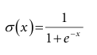
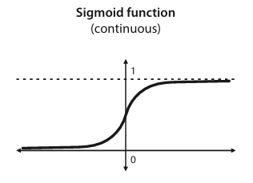
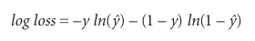

# Logistic classifiers

## Bij logistic classifiers wordt de sigmoïde als activation function gebruikt.
**Wat is de wiskundige vorm van de sigmoïde functie?**

Waarbij:
    - x: de inputwaarde

**Teken het verloop van sigmoïde voor de waarden op de x-as die lopen van −∞ t.e.m. +∞.**
De sigmoïde functie neemt de gehele reële getallenlijn als input en "vervormt" deze tot het interval [0, 1]. 
Voor grote negatieve inputwaarden benadert de sigmoïde functie 0, voor grote positieve inputwaarden benadert de sigmoïde functie 1, en voor inputwaarden rond 0 is de sigmoïde functie ongeveer 0.5.

**Wat zijn de voordelen van het gebruik van de sigmoïde in vergelijking met een stap functie?**
De sigmoïde functie is een continue en differentieerbare functie, in tegenstelling tot de stapfunctie, die discontinu is. Dit maakt het mogelijk om gradient descent te gebruiken voor het optimaliseren van de parameters van het model.
De sigmoïde functie kan een continue voorspelling geven die meer informatie bevat dan de discrete voorspelling van de stapfunctie. Deze continue voorspelling kan worden geïnterpreteerd als de kans dat een bepaald datapunt tot een bepaalde klasse behoort.

## Bij logistic classifiers wordt de log loss error function toegepast.
**Wat is de wiskundige vorm van de log loss error function?**
De log loss voor een enkel datapunt met label $y$ en voorspelling $\hat{y}$ is als volgt gedefinieerd:

Waarbij:
    - y: het ware label (0 of 1)
    - $\hat{y}$: de voorspelde kans dat het datapunt tot klasse 1 behoort
Als $y=1$, dan wordt de log loss voor dat datapunt gelijk aan $-\log(\hat{y})$.
Als $y=0$, dan wordt de log loss voor dat datapunt gelijk aan $-\log(1-\hat{y})$.

**Waarom verkiest men deze error function boven de absolute of square error function?**
De voornaamste redenen hiervoor zijn:
- De afgeleide van de log loss functie zijn veel "fijner" dan die van de absolute of square error functie in context van classificatieproblemen. Dit is cruciaal voor het gebruik van gradient descent om de parameters van het model te optimaliseren.
- De log loss functie is gevoeliger voor slechte voorspellingen. Wanneer het model een datapunt verkeerd classificeert met een hoge mate van zekerheid, zal de log loss functie een hoge waarde geven.
- De output van een logistic classifier kan worden geïnterpreteerd als een waarschijnlijkheid. De log los is direct gerelateerd aan het maximaliseren van de waarschijnlijkheid van de correcte klasse.

## Bespreek hoe het geoptimaliseerde logistic regression algoritme ( = logistic trick) functioneert. Toon aan hoe het leerproces geleidelijk aan de classificatie van de oorspronkelijke dataset verbetert.
- **Input**:
    - Een logistic classifier met gewichten a,b en bias c
    - Een punt met coördinaten x1 en x2 en label y
    - Een leersnelheid (learning rate)

- **Output**:
    - Een perceptron classifier met nieuwe gewichten a',b' en bias c' die de dataset beter classificeert

- **Procedure**:
    - De voorspelling van de logistic classifier wordt berekend met de vergelijking:
    $\hat{y} = \sigma(ax1 + bx2 + c)$

- **Return**:
    - De perceptron met nieuwe gewichten en bias:
    $a' = a + learning\_rate * (y - \hat{y}) * x1$
    $b' = b + learning\_rate * (y - \hat{y}) * x2$
    $c' = c + learning\_rate * (y - \hat{y})$